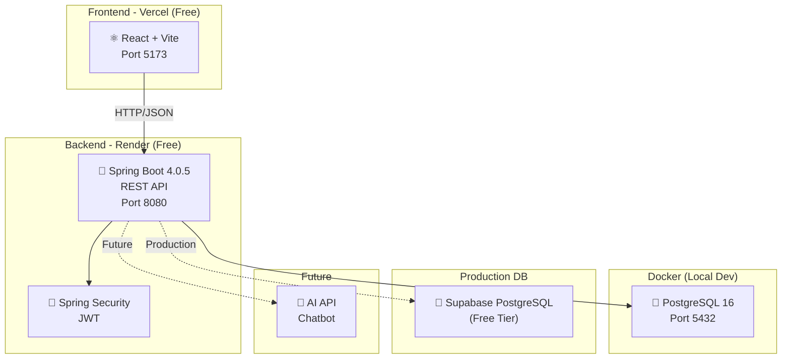
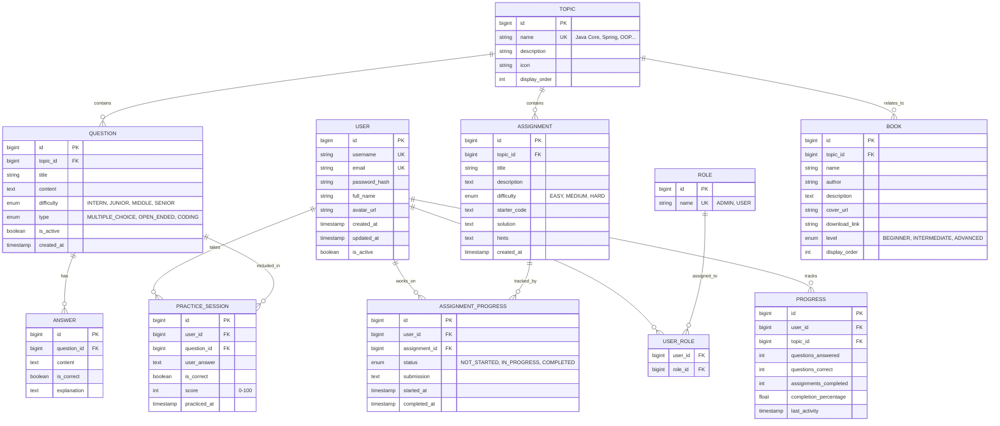

# 🚀 Java Mentor Hub — Implementation Plan

## 1. Tổng Quan Dự Án

**Java Mentor Hub** là một platform cá nhân giúp:
- 📚 Chia sẻ kiến thức Java chuyên sâu (sách, tài liệu, bài tập)
- 🎯 Luyện interview Java (practice mode, question bank)
- 📊 Track tiến độ học tập của user
- 👤 Giới thiệu bản thân (About Me)
- 🤖 *(Tương lai)* Tích hợp AI chatbot hỏi đáp

**GitHub**: [https://github.com/thanhdatpb/Java_Mentor_Hub](https://github.com/thanhdatpb/Java_Mentor_Hub) (Private)

**Tech Stack cốt lõi**: Java 17 · Spring Boot 4.0.5 · PostgreSQL 16 (Docker) · React + Vite · Docker · Render + Vercel (Free)

---

## 2. Kiến Trúc Hệ Thống

### 2.1 Tổng Quan Architecture



### 2.2 Project Structure (Monorepo)

```
Java_Mentor_Hub/
├── backend/                          # Spring Boot REST API
│   ├── src/main/java/com/thanhdatpb/javamentorhub/
│   │   ├── JavaMentorHubApplication.java
│   │   ├── config/
│   │   │   ├── SecurityConfig.java
│   │   │   ├── CorsConfig.java        # CORS cho React
│   │   │   ├── CacheConfig.java
│   │   │   └── OpenApiConfig.java
│   │   ├── controller/
│   │   │   ├── AuthController.java
│   │   │   ├── QuestionController.java
│   │   │   ├── AssignmentController.java
│   │   │   ├── BookController.java
│   │   │   ├── PracticeController.java
│   │   │   ├── ProgressController.java
│   │   │   └── TopicController.java
│   │   ├── dto/
│   │   │   ├── request/
│   │   │   └── response/
│   │   ├── entity/
│   │   │   ├── User.java
│   │   │   ├── Role.java
│   │   │   ├── Question.java
│   │   │   ├── Answer.java
│   │   │   ├── Assignment.java
│   │   │   ├── Book.java
│   │   │   ├── Topic.java
│   │   │   ├── PracticeSession.java
│   │   │   ├── AssignmentProgress.java
│   │   │   └── Progress.java
│   │   ├── repository/
│   │   ├── service/
│   │   │   ├── AuthService.java
│   │   │   ├── QuestionService.java
│   │   │   ├── AssignmentService.java
│   │   │   ├── BookService.java
│   │   │   ├── PracticeService.java
│   │   │   ├── ProgressService.java
│   │   │   └── TopicService.java
│   │   ├── security/
│   │   │   ├── JwtTokenProvider.java
│   │   │   ├── JwtAuthFilter.java
│   │   │   └── CustomUserDetailsService.java
│   │   ├── exception/
│   │   │   ├── GlobalExceptionHandler.java
│   │   │   └── ResourceNotFoundException.java
│   │   ├── mapper/
│   │   └── seed/
│   │       └── DataSeeder.java         # Auto seed từ Notion
│   ├── src/main/resources/
│   │   ├── application.yml
│   │   ├── application-dev.yml
│   │   ├── application-prod.yml
│   │   └── db/migration/              # Flyway
│   │       └── V1__init_schema.sql
│   ├── build.gradle
│   ├── Dockerfile
│   └── settings.gradle
│
├── frontend/                          # React + Vite
│   ├── src/
│   │   ├── components/
│   │   │   ├── layout/
│   │   │   │   ├── Navbar.jsx
│   │   │   │   ├── Footer.jsx
│   │   │   │   └── Sidebar.jsx
│   │   │   ├── common/
│   │   │   │   ├── Button.jsx
│   │   │   │   ├── Card.jsx
│   │   │   │   ├── Modal.jsx
│   │   │   │   └── Loading.jsx
│   │   │   ├── auth/
│   │   │   │   ├── LoginForm.jsx
│   │   │   │   └── RegisterForm.jsx
│   │   │   ├── questions/
│   │   │   ├── practice/
│   │   │   ├── assignments/
│   │   │   ├── books/
│   │   │   └── progress/
│   │   ├── pages/
│   │   │   ├── HomePage.jsx
│   │   │   ├── LoginPage.jsx
│   │   │   ├── RegisterPage.jsx
│   │   │   ├── DashboardPage.jsx
│   │   │   ├── QuestionsPage.jsx
│   │   │   ├── PracticePage.jsx
│   │   │   ├── AssignmentsPage.jsx
│   │   │   ├── BooksPage.jsx
│   │   │   ├── AboutPage.jsx
│   │   │   └── AdminPage.jsx
│   │   ├── services/                  # API calls
│   │   │   ├── api.js                 # Axios config
│   │   │   ├── authService.js
│   │   │   ├── questionService.js
│   │   │   └── ...
│   │   ├── context/
│   │   │   └── AuthContext.jsx
│   │   ├── hooks/
│   │   ├── utils/
│   │   ├── assets/
│   │   ├── App.jsx
│   │   ├── App.css
│   │   └── main.jsx
│   ├── index.html
│   ├── package.json
│   ├── vite.config.js
│   └── Dockerfile
│
├── docker-compose.yml                 # PostgreSQL local
├── .github/
│   └── workflows/
│       └── ci.yml                     # GitHub Actions
├── .gitignore
└── README.md
```

---

## 3. Database Design

### 3.1 Entity Relationship Diagram



---

## 4. Tech Stack Chi Tiết

### 4.1 Backend

| Technology | Version | Mục đích |
|-----------|---------|----------|
| **Java** | 17 (LTS) | Ngôn ngữ chính |
| **Spring Boot** | 4.0.5 | Framework |
| **Spring Security** | 7.x | JWT Authentication |
| **Spring Data JPA** | — | ORM layer |
| **Flyway** | — | Database migration |
| **PostgreSQL** | 16 | Database (trên Docker) |
| **Lombok** | — | Giảm boilerplate |
| **MapStruct** | — | Entity ↔ DTO mapping |
| **Springdoc OpenAPI** | 3.x | Swagger API docs |
| **Caffeine** | — | In-memory cache |

### 4.2 Frontend

| Technology | Version | Mục đích |
|-----------|---------|----------|
| **React** | 19.x | UI framework |
| **Vite** | 6.x | Build tool (nhanh hơn CRA) |
| **React Router** | 7.x | Client-side routing |
| **Axios** | — | HTTP client |
| **Chart.js** | — | Progress visualization |
| **React Icons** | — | Icon library |
| **Vanilla CSS** | — | Styling |

### 4.3 DevOps

| Technology | Mục đích | Chi phí |
|-----------|----------|---------|
| **Docker** | PostgreSQL local + Containerize app | Free |
| **Docker Compose** | Multi-container orchestration | Free |
| **Render** | Deploy backend | **$0** (Free tier) |
| **Vercel** | Deploy React frontend | **$0** (Free tier) |
| **Supabase** | Production PostgreSQL | **$0** (Free tier, 500MB) |
| **GitHub Actions** | CI/CD | **$0** (2000 min/month) |

---

## 5. Chi Phí (Mục Tiêu: $0/tháng)

### 5.1 Development (Local)

| Service | Chi phí |
|---------|---------|
| Docker Desktop (PostgreSQL) | $0 |
| IntelliJ / VS Code | $0 |
| **Tổng** | **$0** |

### 5.2 Production (Deploy)

| Service | Free Tier Limits | Chi phí |
|---------|-----------------|---------|
| Render (Backend) | 750 hrs/month, spin down after 15min idle | $0 |
| Vercel (Frontend) | 100GB bandwidth, unlimited deploys | $0 |
| Supabase (Database) | 500MB storage, 50K rows | $0 |
| GitHub (Code + CI) | Unlimited private repos, 2000 CI minutes | $0 |
| **Tổng/tháng** | | **$0** |

> [!TIP]
> **Chiến lược 2 deployment miễn phí**: Backend (Render) + Frontend (Vercel) mỗi cái dùng free tier riêng. React trên Vercel load cực nhanh (static). Backend trên Render có cold start ~30s nhưng chấp nhận được cho personal project.

---

## 6. Lộ Trình Phát Triển

### Phase 1: Foundation (Tuần 1) 🏗️

> **Mục tiêu**: Project chạy được, database kết nối, auth hoạt động

**Backend:**
- [ ] Khởi tạo Spring Boot 4.0.5 project (Gradle)
- [ ] `docker-compose.yml` cho PostgreSQL 16
- [ ] Cấu hình `application.yml` (dev/prod profiles)
- [ ] Tạo tất cả JPA Entities + Flyway migration V1
- [ ] Spring Security + JWT Authentication
- [ ] Auth API: Register, Login, Me
- [ ] Global Exception Handler
- [ ] CORS config cho React
- [ ] Swagger UI (Springdoc)

**Frontend:**
- [ ] Khởi tạo React + Vite project
- [ ] Setup React Router
- [ ] Axios config + interceptors (JWT)
- [ ] Auth Context (login state management)
- [ ] Login / Register pages
- [ ] Layout component (Navbar, Footer)

**Bạn sẽ học được:** Spring Security, JWT flow, Docker Compose, React basics

---

### Phase 2: Core CRUD (Tuần 2) 📝

> **Mục tiêu**: CRUD đầy đủ cho tất cả resource, có Swagger test được

**Backend:**
- [ ] Question CRUD + pagination + filtering (topic, difficulty)
- [ ] Assignment CRUD + filtering
- [ ] Book CRUD + filtering
- [ ] Topic CRUD
- [ ] Seed data tự động (DataSeeder.java) — từ nội dung Notion
- [ ] DTO + MapStruct mapping
- [ ] Bean Validation

**Frontend:**
- [ ] Questions page (list + filter + search)
- [ ] Assignments page (list + filter)
- [ ] Books page (grid cards)
- [ ] Admin panel (CRUD forms)

**Bạn sẽ học được:** RESTful API design, Pagination, DTO pattern, Validation

---

### Phase 3: Practice Mode & Progress (Tuần 3) 🎯

> **Mục tiêu**: Feature cốt lõi — luyện interview + tracking

**Backend:**
- [ ] Random question algorithm (by topic + difficulty)
- [ ] Practice session: start → answer → score
- [ ] Practice history cho user
- [ ] Progress calculation per topic
- [ ] Dashboard statistics API
- [ ] Caching với Caffeine

**Frontend:**
- [ ] Practice mode UI (quiz-style interface)
- [ ] Progress dashboard (charts, stats)
- [ ] Practice history page
- [ ] Assignment progress tracking

**Bạn sẽ học được:** Business logic, Caching, Statistics queries, Chart.js

---

### Phase 4: About Me & UI Polish (Tuần 4) ✨

> **Mục tiêu**: Professional UI, About Me page, responsive

**Frontend:**
- [ ] Landing page (hero section, features, CTA)
- [ ] About Me page (Trần Thành Đạt · Java Dev · ĐH Khoa học Huế)
- [ ] Dark/Light mode toggle
- [ ] Responsive design (mobile-friendly)
- [ ] Animations & transitions
- [ ] Loading states & error handling

**Bạn sẽ học được:** UX/UI principles, Responsive design, React patterns

---

### Phase 5: Deploy & DevOps (Tuần 5) 🚀

> **Mục tiêu**: Production deployment, CI/CD

- [ ] Multi-stage Dockerfile cho Backend
- [ ] Dockerfile cho Frontend
- [ ] Supabase PostgreSQL setup (production DB)
- [ ] Deploy backend → Render
- [ ] Deploy frontend → Vercel
- [ ] GitHub Actions CI/CD pipeline
- [ ] Environment variables management
- [ ] README.md (professional, with badges)
- [ ] Health check + Actuator

**Bạn sẽ học được:** Docker, CI/CD, Production deployment, DevOps basics

---

### Phase 6: AI Chatbot (Tương lai) 🤖

> **Mục tiêu**: Tích hợp AI hỏi đáp Java

- [ ] Chat UI component
- [ ] Backend AI service (call OpenAI/Groq API)
- [ ] Context-aware responses (biết nội dung câu hỏi trong system)
- [ ] AI chấm điểm câu trả lời open-ended

> [!NOTE]
> Phase này sẽ phát sinh chi phí API. Có thể dùng **Groq** (free tier) hoặc **Google AI Studio** (free tier) để giữ $0/tháng.

---

## 7. API Endpoints

### Authentication
| Method | Endpoint | Access | Mô tả |
|--------|----------|--------|--------|
| POST | `/api/auth/register` | Public | Đăng ký |
| POST | `/api/auth/login` | Public | Đăng nhập → JWT |
| GET | `/api/auth/me` | Auth | Profile user |

### Questions
| Method | Endpoint | Access | Mô tả |
|--------|----------|--------|--------|
| GET | `/api/questions` | Public | List + pagination + filter |
| GET | `/api/questions/{id}` | Public | Detail |
| POST | `/api/questions` | Admin | Create |
| PUT | `/api/questions/{id}` | Admin | Update |
| DELETE | `/api/questions/{id}` | Admin | Delete |
| GET | `/api/questions/random` | Auth | Random cho practice |

### Assignments
| Method | Endpoint | Access | Mô tả |
|--------|----------|--------|--------|
| GET | `/api/assignments` | Public | List |
| GET | `/api/assignments/{id}` | Public | Detail |
| POST | `/api/assignments` | Admin | Create |
| PUT | `/api/assignments/{id}` | Admin | Update |
| DELETE | `/api/assignments/{id}` | Admin | Delete |
| POST | `/api/assignments/{id}/submit` | Auth | Submit bài |

### Books
| Method | Endpoint | Access | Mô tả |
|--------|----------|--------|--------|
| GET | `/api/books` | Public | List |
| POST | `/api/books` | Admin | Create |
| PUT | `/api/books/{id}` | Admin | Update |
| DELETE | `/api/books/{id}` | Admin | Delete |

### Practice
| Method | Endpoint | Access | Mô tả |
|--------|----------|--------|--------|
| POST | `/api/practice/start` | Auth | Start session |
| POST | `/api/practice/submit` | Auth | Submit answer |
| GET | `/api/practice/history` | Auth | History |

### Progress
| Method | Endpoint | Access | Mô tả |
|--------|----------|--------|--------|
| GET | `/api/progress/dashboard` | Auth | Overview |
| GET | `/api/progress/topics/{id}` | Auth | Per topic |

### Topics
| Method | Endpoint | Access | Mô tả |
|--------|----------|--------|--------|
| GET | `/api/topics` | Public | List all |
| POST | `/api/topics` | Admin | Create |

---

## 8. About Me — Thiết Kế Chi Tiết

### 8.1 Thông tin hiển thị

| Section | Nội dung |
|---------|---------|
| **Hero** | Avatar + **Trần Thành Đạt** + "Java Backend Developer" |
| **Giới thiệu** | Passionate Java developer, thích chạy bộ 🏃, đang build Java Mentor Hub |
| **Đại học** | Khoa Công nghệ thông tin, Trường Đại học Khoa học, Đại học Huế |
| **Skills** | Java, Spring Boot, PostgreSQL, Docker, React... |
| **Dự án** | Link tới Java Mentor Hub (chính nó!) |
| **Contact** | GitHub: thanhdatpb · LinkedIn: thanhdatpb · Email: Tthanhdat.pb@gmail.com |

### 8.2 Design Concept

```
┌─────────────────────────────────────────────┐
│                                             │
│   ┌──────┐                                  │
│   │Avatar│  Trần Thành Đạt                  │
│   │ ảnh  │  Java Backend Developer          │
│   └──────┘  🏃 Runner · Builder · Learner   │
│                                             │
├─────────────────────────────────────────────┤
│  📖 About                                   │
│  Sinh viên CNTT tại ĐH Khoa học Huế,        │
│  đam mê Java backend & system design...     │
│                                             │
├─────────────────────────────────────────────┤
│  🎓 Education                               │
│  Khoa CNTT, ĐH Khoa học, ĐH Huế            │
│  Ngành: Công nghệ thông tin                 │
│                                             │
├─────────────────────────────────────────────┤
│  🛠 Skills                                   │
│  Java         ████████████░░ 85%            │
│  Spring Boot  ██████████░░░ 80%             │
│  PostgreSQL   ████████░░░░░ 65%             │
│  Docker       ██████░░░░░░░ 50%             │
│                                             │
├─────────────────────────────────────────────┤
│  📫 Contact                                  │
│  [GitHub] [LinkedIn] [Email]                │
│                                             │
└─────────────────────────────────────────────┘
```

---

## 9. Seed Data (Tự Động)

### 9.1 Books (từ Notion của Thành Đạt)

```java
// DataSeeder.java — tự động insert khi app khởi động lần đầu
Book[] books = {
    new Book("Head First Java A Brain Friendly Guide",
             "Java Core", "Sách cho người mới học hoặc củng cố lại kiến thức", BEGINNER),
    new Book("Java OCA Oracle Certified - Exam 1Z0-808",
             "Java Core", "Thi chứng chỉ JAVA thì nên đọc", INTERMEDIATE),
    new Book("Head First Design Patterns 2nd Edition",
             "Design Pattern", "Xem để code xịn hơn", INTERMEDIATE),
    new Book("Dive into Design Pattern",
             "Design Pattern", "Sách của guru.refactor — nên đọc", INTERMEDIATE),
    new Book("System Design Interview An Insiders Guide",
             "System Design", "Sách về design system — bắt buộc đọc", ADVANCED),
    new Book("System Design ByteByteGo",
             "System Design", "Xem để biết system design có những gì", ADVANCED),
};
```

### 9.2 Topics (từ cấu trúc Notion)

```java
Topic[] topics = {
    new Topic("Java Core",        "Kiến thức nền tảng Java",            "☕", 1),
    new Topic("OOP",              "Lập trình hướng đối tượng",          "🧱", 2),
    new Topic("Spring Framework", "Spring Boot, Security, Data JPA",    "🍃", 3),
    new Topic("Design Patterns",  "Gang of Four + Enterprise patterns", "🏗️", 4),
    new Topic("System Design",    "Thiết kế hệ thống",                  "📐", 5),
    new Topic("Database",         "SQL, PostgreSQL, Indexing, Transaction","🗄️", 6),
    new Topic("Concurrency",      "Multi-threading, Synchronization",   "⚡", 7),
    new Topic("Interview Q&A",    "Câu hỏi phỏng vấn thường gặp",      "🎯", 8),
};
```

---

## 10. Cách Nói Về Project Trong Interview

### Khi được hỏi "Em có project nào không?"

> *"Em đã xây dựng **Java Mentor Hub** — một platform hỗ trợ luyện interview Java. Về backend, em sử dụng **Spring Boot 4** với kiến trúc layered, triển khai **JWT authentication** với role-based authorization. Em thiết kế **RESTful API** với pagination, filtering, và validation. Điểm đặc biệt là **Practice Mode** cho phép user luyện tập câu hỏi random và **tracking progress** theo từng topic. Database dùng **PostgreSQL** với **Flyway** cho migration. Frontend dùng **React**. Project được containerize bằng **Docker** và deploy trên cloud với **CI/CD pipeline** qua GitHub Actions."*

### Câu hỏi follow-up interviewer sẽ hỏi:

| Câu hỏi | Bạn sẽ trả lời được vì đã implement |
|---------|--------------------------------------|
| JWT hoạt động thế nào? | ✅ Đã implement JwtTokenProvider |
| Database design thế nào? | ✅ Đã thiết kế ERD 10+ entities |
| Xử lý N+1 query? | ✅ Đã dùng JOIN FETCH, pagination |
| Caching strategy? | ✅ Caffeine cache cho question list |
| Security xử lý role-based thế nào? | ✅ @PreAuthorize, ADMIN/USER roles |
| Deploy flow? | ✅ Docker → GitHub Actions → Render |

---

## 11. Verification Plan

### Automated Tests
```bash
# Backend tests
./gradlew test

# Kiểm tra:
# - Unit tests (Service layer) - JUnit 5 + Mockito
# - Integration tests (Repository) - @DataJpaTest
# - API tests (Controller) - @WebMvcTest
# - Security tests (auth/unauth access)
```

### Manual Verification
- [ ] Test tất cả API qua Swagger UI (`/swagger-ui.html`)
- [ ] Test React UI trên Chrome + Firefox
- [ ] Test responsive trên Chrome DevTools mobile view
- [ ] Test full flow: Register → Login → Practice → Check Progress
- [ ] Test admin flow: Login as admin → CRUD questions/books
- [ ] Test Docker deployment local: `docker-compose up`
- [ ] Test deploy Render + Vercel

---

## 12. Trạng Thái Hiện Tại

### ✅ Đã hoàn thành (Phase 1 — đang trong quá trình)
- [x] `docker-compose.yml` → PostgreSQL đang chạy (healthy ✅)
- [x] `build.gradle` → dependencies đầy đủ
- [x] `application.yml` / `application-dev.yml` / `application-prod.yml`
- [x] `V1__init_schema.sql` → schema + seed books & topics
- [x] 10 Entity classes (User, Role, Topic, Question, Answer, Assignment, Book, PracticeSession, AssignmentProgress, Progress)
- [x] 5 Enums (Difficulty, QuestionType, BookLevel, AssignmentStatus, AssignmentDifficulty)
- [x] `JavaMentorHubApplication.java`

### 🔄 Đang làm tiếp
- [ ] Security layer: CustomUserDetailsService, JwtTokenProvider, JwtAuthFilter
- [ ] SecurityConfig + CorsConfig
- [ ] AuthController (Login, Register, Me)
- [ ] GlobalExceptionHandler
